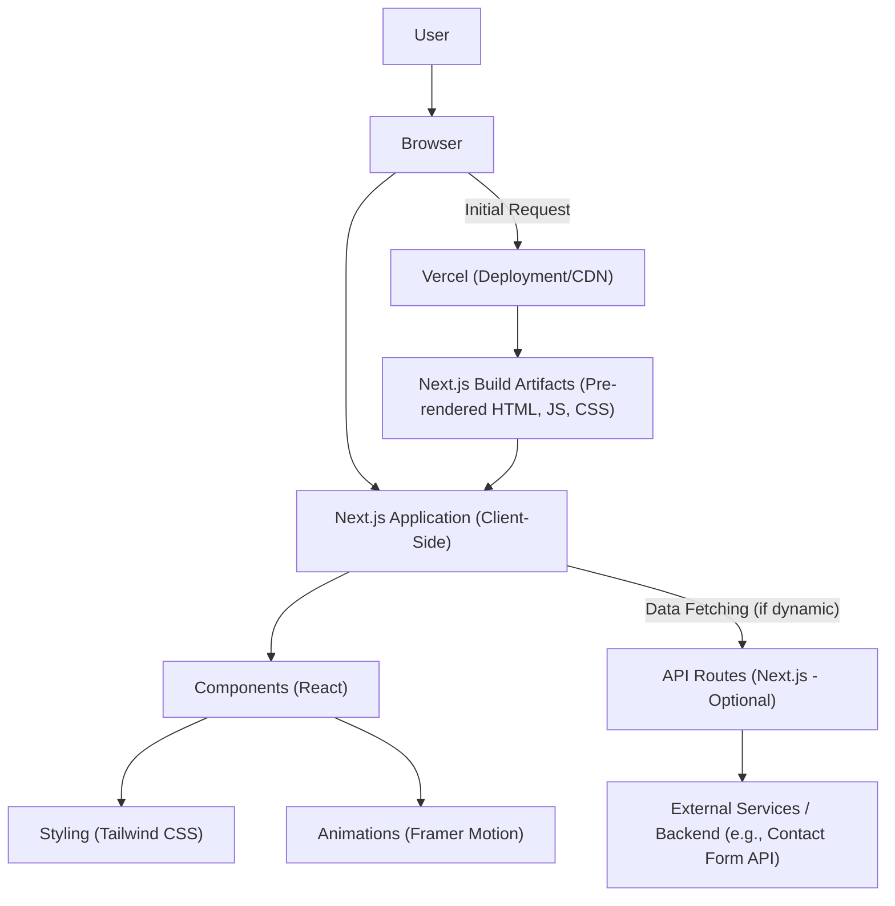

# Devportfolio: A Modern Developer Portfolio 🚀

[](https://nextjs.org/)
[](https://www.typescriptlang.org/)
[](https://tailwindcss.com/)
[](https://www.framer.com/motion/)
[](https://vercel.com/)
[](https://opensource.org/licenses/MIT)

## Table of Contents 📖

*   [Description](#description-)
*   [Features](#features-)
*   [Tech Stack](#tech-stack-)
*   [Installation](#installation-)
*   [Usage](#usage-)
*   [Architecture](#architecture-)
*   [Contributing](#contributing-)
*   [License](#license-)

## Description 📝

Devportfolio is a sleek, modern, and highly responsive personal portfolio website designed for developers to showcase their skills, projects, and experience. Built with the latest web technologies including Next.js, TypeScript, and Tailwind CSS, it offers a fast, accessible, and visually appealing platform to present your professional profile to the world. The application emphasizes a clean user interface, smooth animations powered by Framer Motion, and a seamless user experience across various devices.

## Features ✨

*   **Responsive Design** 📱: Optimized for an excellent viewing experience on desktops, tablets, and mobile devices.
*   **Dark/Light Mode Toggle** 🌓: Allows users to switch between preferred color schemes for enhanced readability and comfort.
*   **Smooth Animations** 💫: Utilizes Framer Motion for elegant transitions and interactive UI elements, providing a dynamic user experience.
*   **Dedicated Sections** 📂:
    *   **Home**: A welcoming introduction.
    *   **About**: Personal background and professional journey.
    *   **Skills**: A comprehensive overview of technical proficiencies.
    *   **Experience**: A timeline of professional roles and achievements.
    *   **Projects**: Showcase of personal and professional projects with descriptions and links.
    *   **Contact**: A convenient way for visitors to get in touch.
*   **SEO Friendly** 🔍: Built with Next.js, ensuring optimal search engine visibility and performance.
*   **Modular Component Structure** 🧩: Easy to understand, maintain, and extend due to a well-organized component-based architecture.

## Tech Stack 🛠️

*   **Framework**: [Next.js](https://nextjs.org/) (React Framework)
*   **Language**: [TypeScript](https://www.typescriptlang.org/)
*   **Styling**: [Tailwind CSS](https://tailwindcss.com/)
*   **Animations**: [Framer Motion](https://www.framer.com/motion/)
*   **Icons**: [React Icons](https://react-icons.github.io/react-icons/)
*   **Deployment**: [Vercel](https://vercel.com/)

## Installation ⚙️

To get a local copy up and running, follow these simple steps.

### Prerequisites

Make sure you have Node.js (v18.x or higher) and npm (or yarn) installed on your machine.

*   npm
    ```bash
    npm install npm@latest -g
    ```
*   yarn
    ```bash
    npm install --global yarn
    ```

### Clone the Repository

```bash
git clone https://github.com/Can-Ozan/Devportfolio.git
cd Devportfolio
```

### Install Dependencies

Using npm:

```bash
npm install
```

Or using yarn:

```bash
yarn install
```

### Environment Variables (Optional)

This project does not strictly require environment variables for basic functionality. However, if you plan to integrate external services (e.g., a contact form API, analytics), create a `.env.local` file in the root directory and add your variables:

```
# Example:
# NEXT_PUBLIC_ANALYTICS_ID=UA-XXXXXXXXX-Y
```

## Usage ▶️

### Running the Development Server

To start the development server:

```bash
npm run dev
# or
yarn dev
```

Open [http://localhost:3000](http://localhost:3000) with your browser to see the result.

The application will automatically reload if you make changes to the source code.

### Building for Production

To build the application for production:

```bash
npm run build
# or
yarn build
```

This command optimizes your application for production, creating an `.next` folder.

### Starting the Production Server

To run the built application in production mode:

```bash
npm run start
# or
yarn start
```

This will serve the application on [http://localhost:3000](http://localhost:3000).

## Architecture 🏛️

The Devportfolio project leverages the power of Next.js, a React framework that supports both Client-Side Rendering (CSR) and Static Site Generation (SSG). For a personal portfolio, SSG is often utilized for its performance benefits, serving pre-built HTML, CSS, and JavaScript to the client.

The architecture can be visualized as follows:



**Explanation:**

*   **User & Browser**: The user interacts with the application through their web browser.
*   **Vercel (Deployment/CDN)**: The application is deployed on Vercel, which acts as a Content Delivery Network (CDN), serving the pre-built Next.js artifacts efficiently.
*   **Next.js Build Artifacts**: During the build process (`npm run build`), Next.js generates optimized static HTML, CSS, and JavaScript files for each page, which are then hosted by Vercel.
*   **Next.js Application (Client-Side)**: Once loaded in the browser, the JavaScript hydrates the static content, turning it into a fully interactive React application.
*   **Components (React)**: The UI is composed of reusable React components (e.g., `Header`, `ProjectCard`, `SkillIcon`).
*   **Styling (Tailwind CSS)**: All styling is handled using Tailwind CSS utility classes, providing a highly customizable and efficient styling approach.
*   **Animations (Framer Motion)**: Interactive elements and transitions are powered by Framer Motion, adding a layer of polish and dynamism.
*   **API Routes (Next.js - Optional)**: While primarily a static portfolio, Next.js allows for API routes to handle server-side logic (e.g., sending contact form emails). This project might integrate such routes for specific functionalities.
*   **External Services / Backend**: If API routes are used, they might communicate with external services or a custom backend for specific tasks like form submissions or data storage.

This architecture ensures a fast loading experience due to static pre-rendering and efficient content delivery, combined with the interactivity of a modern React application.

## Contributing 🤝

Contributions are what make the open-source community such an amazing place to learn, inspire, and create. Any contributions you make are **greatly appreciated**.

If you have a suggestion that would make this better, please fork the repo and create a pull request. You can also simply open an issue with the tag "enhancement".

1.  Fork the Project
2.  Create your Feature Branch (`git checkout -b feature/AmazingFeature`)
3.  Commit your Changes (`git commit -m 'Add some AmazingFeature'`)
4.  Push to the Branch (`git push origin feature/AmazingFeature`)
5.  Open a Pull Request

## License 📄

This project is licensed under the MIT License. See the `LICENSE` file (if present, otherwise assumed MIT for open-source projects) for more details.
