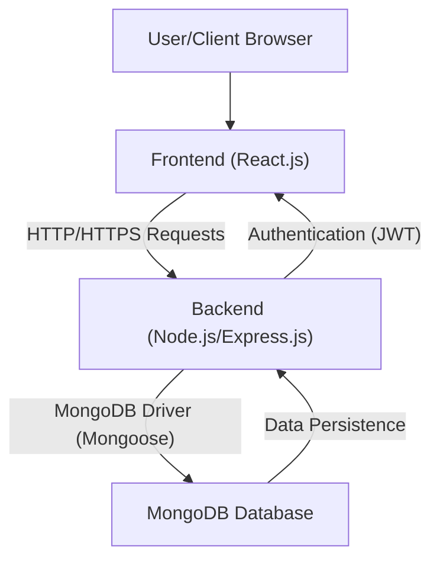

# Devportfolio: Full-Stack Developer Portfolio 🚀

[](https://opensource.org/licenses/MIT)
[](https://react.dev/)
[](https://nodejs.org/)
[](https://expressjs.com/)
[](https://www.mongodb.com/)
[](https://www.docker.com/)

Devportfolio is a modern, full-stack developer portfolio application designed to elegantly showcase your projects, skills, and professional experience. Built with a robust MERN stack (MongoDB, Express.js, React, Node.js) and fully containerized with Docker, it provides a seamless and scalable platform for developers to present their work to the world.

This project emphasizes a clean, responsive user interface combined with a secure and efficient backend, complete with administrative capabilities for content management.

## Table of Contents 📖

*   [Features ✨](#features-%e2%9c%a8)
*   [Tech Stack 🚀](#tech-stack-%f0%9f%9a%80)
*   [Architecture 🏗️](#architecture-%f0%9f%8f%97%ef%b8%8f)
*   [Getting Started 🏁](#getting-started-%f0%9f%8f%81)
    *   [Prerequisites](#prerequisites)
    *   [Environment Variables](#environment-variables)
    *   [Installation with Docker (Recommended)](#installation-with-docker-recommended)
    *   [Manual Installation](#manual-installation)
        *   [Backend Setup](#backend-setup)
        *   [Frontend Setup](#frontend-setup)
*   [REST API Endpoints 🌐](#rest-api-endpoints-%f0%9f%8c%90)
*   [Contributing Guidelines 🤝](#contributing-guidelines-%f0%9f%a4%9d)
*   [License 📄](#license-%f0%9f%93%84)
*   [Contact 📧](#contact-%f0%9f%93%a7)

## Features ✨

*   **Dynamic Project Showcase:** Display your projects with images, descriptions, links, and technologies used.
*   **Comprehensive Skill Listing:** Highlight your technical proficiencies across various domains.
*   **Responsive Design:** A beautiful and functional user interface that adapts to any screen size.
*   **Contact Form:** Allow visitors to send you messages directly.
*   **Admin Panel (Authentication):** Securely manage projects, skills, and messages via an authenticated dashboard.
*   **RESTful API:** A well-structured API for seamless data interaction between frontend and backend.
*   **Dockerized Deployment:** Easy setup and deployment using Docker and Docker Compose.

## Tech Stack 🚀

Devportfolio leverages a modern and powerful technology stack to deliver a robust and scalable application.

**Frontend:**
*   **React.js:** A declarative, component-based JavaScript library for building user interfaces.
*   **React Router:** For declarative routing within the React application.
*   **Axios:** Promise-based HTTP client for making API requests.
*   **Tailwind CSS (or similar):** A utility-first CSS framework for rapid UI development.

**Backend:**
*   **Node.js:** A JavaScript runtime built on Chrome's V8 JavaScript engine.
*   **Express.js:** A fast, unopinionated, minimalist web framework for Node.js.
*   **Mongoose:** An elegant MongoDB object modeling tool for Node.js.
*   **JSON Web Tokens (JWT):** For secure user authentication and authorization.
*   **Bcrypt.js:** For hashing passwords securely.

**Database:**
*   **MongoDB:** A NoSQL document database, providing high performance, high availability, and easy scalability.

**Containerization:**
*   **Docker:** Platform for developing, shipping, and running applications in containers.
*   **Docker Compose:** Tool for defining and running multi-container Docker applications.

## Architecture 🏗️

The Devportfolio application follows a typical three-tier architecture, separating the concerns of presentation, business logic, and data storage. This design promotes modularity, scalability, and maintainability.



**Components:**

1.  **Client (User/Browser):** The end-user interacts with the application through their web browser.
2.  **Frontend (React.js):**
    *   Built with React, this layer is responsible for rendering the user interface, handling user interactions, and making API calls to the backend.
    *   It consumes data from the backend API and displays it in a user-friendly format.
    *   Manages client-side routing and state.
3.  **Backend (Node.js/Express.js):**
    *   Acts as the application's API server, handling all business logic.
    *   Receives requests from the frontend, processes them, interacts with the database, and sends back appropriate responses.
    *   Manages user authentication and authorization using JWT.
    *   Defines RESTful API endpoints for projects, skills, messages, and authentication.
4.  **Database (MongoDB):**
    *   A NoSQL database used for storing all application data, including projects, skills, contact messages, and user information.
    *   Accessed by the backend via Mongoose, an ODM (Object Data Modeling) library for Node.js.

**Interaction Flow:**

*   The **User** interacts with the **Frontend** through their web browser.
*   The **Frontend** sends HTTP requests (GET, POST, PUT, DELETE) to the **Backend** to fetch or manipulate data.
*   The **Backend** processes these requests, performs necessary business logic, and communicates with the **MongoDB Database** to store or retrieve data.
*   The **Backend** then sends a response back to the **Frontend**, which updates the UI accordingly.
*   Authentication is handled by the **Backend** issuing JWTs to the **Frontend** upon successful login, which are then used for subsequent authenticated requests.

## Getting Started 🏁

Follow these instructions to get a copy of the project up and running on your local machine for development and testing purposes.

### Prerequisites

Before you begin, ensure you have the following installed:

*   **Git:** For cloning the repository.
    *   [Download Git](https://git-scm.com/downloads)
*   **Node.js & npm (or Yarn):** For running the backend and frontend manually.
    *   [Download Node.js](https://nodejs.org/en/download/) (includes npm)
*   **Docker & Docker Compose:** **Highly recommended** for a streamlined setup.
    *   [Download Docker Desktop](https://www.docker.com/products/docker-desktop) (includes Docker Compose)
*   **MongoDB:** If you choose not to use Docker for the database, you'll need a local or hosted MongoDB instance.
    *   [Download MongoDB Community Server](https://www.mongodb.com/try/download/community)

### Environment Variables

Both the frontend and backend require specific environment variables to function correctly. Create `.env` files in the respective directories (`backend/.env` and `frontend/.env`) and populate them based on the provided `.env.example` files.

**`backend/.env` example:**

```env
PORT=5000
MONGO_URI=mongodb://localhost:27017/devportfolio
JWT_SECRET=your_jwt_secret_key
```

**`frontend/.env` example:**

```env
REACT_APP_API_URL=http://localhost:5000/api
```

**Note:** When using Docker Compose, the `MONGO_URI` for the backend will typically refer to the MongoDB service name defined in `docker-compose.yml` (e.g., `mongodb://mongodb:27017/devportfolio`).

### Installation with Docker (Recommended)

This is the easiest way to get the entire application stack running.

1.  **Clone the repository:**
    ```bash
    git clone https://github.com/Can-Ozan/Devportfolio.git
    cd Devportfolio
    ```

2.  **Create `.env` files:**
    *   Navigate to the `backend` directory and create a `.env` file based on `backend/.env.example`.
        *   For `MONGO_URI`, use `mongodb://mongodb:27017/devportfolio` as `mongodb` is the service name defined in `docker-compose.yml`.
    *   Navigate to the `frontend` directory and create a `.env` file based on `frontend/.env.example`.
        *   For `REACT_APP_API_URL`, use `http://localhost:5000/api` (or the port your backend container is exposed on).

3.  **Build and run the Docker containers:**
    ```bash
    docker-compose up --build
    ```
    This command will:
    *   Build the Docker images for both the frontend and backend services.
    *   Start the MongoDB container.
    *   Start the backend container, connecting to MongoDB.
    *   Start the frontend container, connecting to the backend.

4.  **Access the application:**
    *   **Frontend:** Open your browser and navigate to `http://localhost:3000` (or the port specified in your `docker-compose.yml` for the frontend).
    *   **Backend API:** The backend API will be accessible at `http://localhost:5000/api` (or the port specified).

### Manual Installation

If you prefer to run the frontend and backend separately without Docker, follow these steps. Ensure you have Node.js, npm/yarn, and a running MongoDB instance.

#### Backend Setup

1.  **Navigate to the backend directory:**
    ```bash
    cd Devportfolio/backend
    ```

2.  **Install dependencies:**
    ```bash
    npm install
    # or
    yarn install
    ```

3.  **Create `.env` file:**
    *   Create a `.env` file based on `backend/.env.example`.
    *   Ensure `MONGO_URI` points to your local or hosted MongoDB instance (e.g., `mongodb://localhost:27017/devportfolio`).

4.  **Start the backend server:**
    ```bash
    npm start
    # or
    yarn start
    ```
    The backend server will start on the port specified in your `.env` file (default: `5000`).

#### Frontend Setup

1.  **Navigate to the frontend directory:**
    ```bash
    cd Devportfolio/frontend
    ```

2.  **Install dependencies:**
    ```bash
    npm install
    # or
    yarn install
    ```

3.  **Create `.env` file:**
    *   Create a `.env` file based on `frontend/.env.example`.
    *   Ensure `REACT_APP_API_URL` points to your running backend API (e.g., `http://localhost:5000/api`).

4.  **Start the frontend development server:**
    ```bash
    npm start
    # or
    yarn start
    ```
    The frontend application will open in your browser at `http://localhost:3000` (default for Create React App).

## REST API Endpoints 🌐

The backend exposes a comprehensive set of RESTful API endpoints for managing portfolio data. Authentication is required for administrative actions.

| Method | Endpoint                    | Description                                  | Authentication |
| :----- | :-------------------------- | :------------------------------------------- | :------------- |
| `GET`  | `/api/projects`             | Retrieve all projects.                       | No             |
| `GET`  | `/api/projects/:id`         | Retrieve a single project by ID.             | No             |
| `POST` | `/api/projects`             | Create a new project.                        | Yes (Admin)    |
| `PUT`  | `/api/projects/:id`         | Update an existing project.                  | Yes (Admin)    |
| `DELETE`| `/api/projects/:id`         | Delete a project.                            | Yes (Admin)    |
| `GET`  | `/api/skills`               | Retrieve all skills.                         | No             |
| `POST` | `/api/skills`               | Add a new skill.                             | Yes (Admin)    |
| `PUT`  | `/api/skills/:id`           | Update an existing skill.                    | Yes (Admin)    |
| `DELETE`| `/api/skills/:id`           | Delete a skill.                              | Yes (Admin)    |
| `POST` | `/api/messages`             | Submit a new contact message.                | No             |
| `GET`  | `/api/messages`             | Retrieve all contact messages.               | Yes (Admin)    |
| `DELETE`| `/api/messages/:id`         | Delete a contact message.                    | Yes (Admin)    |
| `POST` | `/api/auth/register`        | Register a new admin user.                   | No             |
| `POST` | `/api/auth/login`           | Authenticate and log in an admin user.       | No             |
| `GET`  | `/api/auth/me`              | Get current authenticated user details.      | Yes            |

## Contributing Guidelines 🤝

Contributions are what make the open-source community such an amazing place to learn, inspire, and create. Any contributions you make are **greatly appreciated**.

If you have a suggestion that would make this better, please fork the repo and create a pull request. You can also simply open an issue with the tag "enhancement".

1.  **Fork** the Project.
2.  **Clone** your forked repository: `git clone https://github.com/YOUR_USERNAME/Devportfolio.git`
3.  **Create your Feature Branch:** `git checkout -b feature/AmazingFeature`
4.  **Commit your Changes:** `git commit -m 'Add some AmazingFeature'`
5.  **Push to the Branch:** `git push origin feature/AmazingFeature`
6.  **Open a Pull Request.**

Please ensure your code adheres to the existing style and conventions.

## License 📄

Distributed under the MIT License. See `LICENSE` for more information.

## Contact 📧

Yusuf Can Ozan
