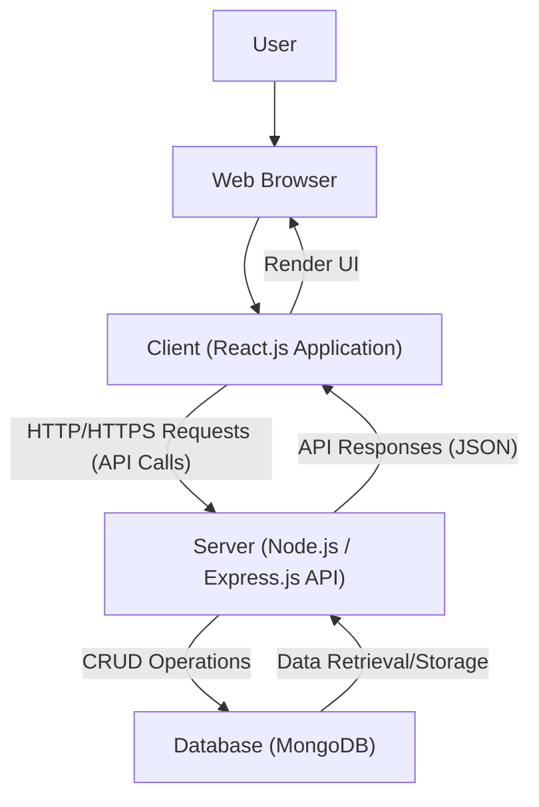

# DevPortfolio: A Full-Stack Personal Portfolio Application 🚀

[](https://opensource.org/licenses/MIT)
[](https://react.dev/)
[](https://nodejs.org/)
[](https://expressjs.com/)
[](https://www.mongodb.com/)
[](https://www.docker.com/)

## Table of Contents 📖

*   [About The Project](#about-the-project-)
*   [Features ✨](#features-)
*   [Tech Stack 🛠️](#tech-stack-%EF%B8%8F)
*   [Architecture 🏗️](#architecture-%EF%B8%8F)
    *   [System Design](#system-design)
    *   [Detailed Explanation](#detailed-explanation)
*   [Getting Started 🚀](#getting-started-%EF%B8%8F)
    *   [Prerequisites](#prerequisites)
    *   [Local Installation](#local-installation)
        *   [1. Clone the Repository](#1-clone-the-repository)
        *   [2. Environment Variables](#2-environment-variables)
        *   [3. Backend Setup](#3-backend-setup)
        *   [4. Frontend Setup](#4-frontend-setup)
    *   [Docker Installation (Recommended)](#docker-installation-recommended)
        *   [1. Docker Prerequisites](#1-docker-prerequisites)
        *   [2. Create Dockerfiles](#2-create-dockerfiles)
        *   [3. Create docker-compose.yml](#3-create-docker-composeyml)
        *   [4. Build and Run with Docker Compose](#4-build-and-run-with-docker-compose)
*   [REST API Endpoints 🌐](#rest-api-endpoints-%EF%B8%8F)
*   [Usage 💡](#usage-)
*   [Contributing 🤝](#contributing-%EF%B8%8F)
*   [License 📄](#license-%EF%B8%8F)
*   [Contact 📧](#contact-%EF%B8%8F)

---

## About The Project 📝

DevPortfolio is a robust, full-stack personal portfolio application designed to showcase your projects, skills, and professional experience in an elegant and interactive manner. Built with the MERN (MongoDB, Express.js, React.js, Node.js) stack, it provides a dynamic and responsive platform for developers to present their work to potential employers and collaborators.

This project emphasizes a clean architecture, maintainability, and scalability, making it an excellent foundation for anyone looking to establish a strong online presence. It includes features like dynamic project display, a dedicated skills section, and a functional contact form to facilitate communication.

---

## Features ✨

*   **Dynamic Project Display**: Showcase your projects with images, descriptions, and links to live demos or repositories.
*   **Comprehensive Skills Section**: Highlight your technical proficiencies with categorized skill sets.
*   **Interactive Contact Form**: Allow visitors to send messages directly to your email via a secure backend service.
*   **Responsive Design**: Optimized for various screen sizes, ensuring a seamless experience on desktop, tablet, and mobile devices.
*   **Client-Side Routing**: Smooth navigation between different sections of the portfolio without full page reloads.
*   **Backend API**: A RESTful API to manage projects, skills, and contact messages.
*   **Database Integration**: Persistent storage for portfolio data using MongoDB.
*   **Dockerized Deployment**: Containerized setup for easy deployment and scalability (example configuration provided).

---

## Tech Stack 🛠️

The DevPortfolio project leverages a modern and powerful technology stack:

*   **Frontend**:
    *   [React.js](https://react.dev/) - A JavaScript library for building user interfaces.
    *   [React Router DOM](https://reactrouter.com/en/main) - Declarative routing for React.
    *   [Axios](https://axios-http.com/) - Promise-based HTTP client for the browser and Node.js.
    *   [Framer Motion](https://www.framer.com/motion/) - A production-ready motion library for React.
    *   [React Icons](https://react-icons.github.io/react-icons/) - Popular icons as React components.
    *   [Sass](https://sass-lang.com/) - CSS pre-processor for enhanced styling.
*   **Backend**:
    *   [Node.js](https://nodejs.org/) - JavaScript runtime environment.
    *   [Express.js](https://expressjs.com/) - Fast, unopinionated, minimalist web framework for Node.js.
    *   [Mongoose](https://mongoosejs.com/) - MongoDB object data modeling (ODM) for Node.js.
    *   [Nodemailer](https://nodemailer.com/)- Module for Node.js applications to allow easy email sending.
    *   [CORS](https://www.npmjs.com/package/cors) - Node.js package for providing a Connect/Express middleware that can be used to enable CORS with various options.
    *   [Dotenv](https://www.npmjs.com/package/dotenv) - Loads environment variables from a `.env` file.
*   **Database**:
    *   [MongoDB](https://www.mongodb.com/) - A NoSQL document database.
*   **Deployment/Containerization**:
    *   [Docker](https://www.docker.com/) - Platform for developing, shipping, and running applications in containers.

---

## Architecture 🏗️

The DevPortfolio project follows a classic client-server architecture, specifically a MERN stack setup, where the frontend (React.js) consumes a RESTful API provided by the backend (Node.js/Express.js), which in turn interacts with a MongoDB database.

### System Design



### Detailed Explanation

1.  **Client (Frontend)**:
    *   The frontend is a Single Page Application (SPA) built with React.js.
    *   It's responsible for rendering the user interface, handling user interactions, and displaying portfolio content.
    *   It communicates with the backend API using `axios` to fetch data (projects, skills) and send data (contact messages).
    *   React Router DOM manages client-side navigation, providing a smooth user experience.
    *   Styling is handled using Sass, allowing for modular and maintainable CSS.

2.  **Server (Backend API)**:
    *   The backend is a RESTful API developed with Node.js and the Express.js framework.
    *   It acts as the intermediary between the client and the database.
    *   **Routes**: Defines API endpoints (e.g., `/api/projects`, `/api/skills`, `/api/contact`) that the client can access.
    *   **Controllers**: Contains the business logic for handling incoming requests, interacting with the database, and preparing responses.
    *   **Models**: Utilizes Mongoose to define schemas for MongoDB collections (e.g., `Project`, `Skill`, `Contact`), providing an object-oriented interface for database operations.
    *   **Security**: Implements CORS middleware to manage cross-origin requests, ensuring secure communication between the client and server.
    *   **Email Service**: Integrates Nodemailer to handle sending contact form submissions as emails.

3.  **Database**:
    *   MongoDB is used as the NoSQL database to store all application data.
    *   It stores collections for `projects`, `skills`, and `contact messages`.
    *   Mongoose provides a robust way to define data structures and interact with MongoDB from the Node.js backend.

4.  **Communication Flow**:
    *   When a user interacts with the React frontend (e.g., navigates to the projects page, submits a contact form), the React application sends an HTTP request to the Express.js backend.
    *   The Express.js server receives the request, processes it (e.g., queries the MongoDB database via Mongoose, sends an email via Nodemailer), and sends back an HTTP response, typically in JSON format.
    *   The React frontend then receives this JSON data and updates the UI accordingly.

This decoupled architecture allows for independent development and scaling of the frontend and backend components, enhancing flexibility and maintainability.

---

## Getting Started 🚀

To get a local copy up and running, follow these simple steps. You can choose between a standard local installation or a Dockerized setup.

### Prerequisites

Ensure you have the following installed on your system:

*   [Node.js](https://nodejs.org/en/download/) (LTS version recommended)
*   [npm](https://www.npmjs.com/get-npm) (comes with Node.js) or [Yarn](https://yarnpkg.com/getting-started/install)
*   [MongoDB](https://www.mongodb.com/try/download/community) (local installation or a cloud service like MongoDB Atlas)
*   [Git](https://git-scm.com/downloads)

### Local Installation

#### 1. Clone the Repository

```bash
git clone https://github.com/Can-Ozan/Devportfolio.git
cd Devportfolio
```

#### 2. Environment Variables

Create a `.env` file in both the `server/` and `client/` directories based on the examples below.

**`server/.env` example:**

```env
PORT=5000
MONGO_URI=mongodb://localhost:27017/devportfolio # Or your MongoDB Atlas URI
EMAIL_USER=your_email@example.com
EMAIL_PASS=your_email_password # Or app-specific password for Gmail/Outlook
CLIENT_URL=http://localhost:3000
```

**`client/.env` example:**

```env
REACT_APP_SERVER_URL=http://localhost:5000/api
```

#### 3. Backend Setup

Navigate to the `server` directory, install dependencies, and start the server.

```bash
cd server
npm install # or yarn install
npm start   # or yarn start
```

The backend server will typically run on `http://localhost:5000`.

#### 4. Frontend Setup

Open a new terminal, navigate to the `client` directory, install dependencies, and start the React development server.

```bash
cd client
npm install # or yarn install
npm start   # or yarn start
```

The frontend application will typically run on `http://localhost:3000`.

---

### Docker Installation (Recommended) 🐳

For a more consistent and isolated development/production environment, you can containerize the application using Docker.

#### 1. Docker Prerequisites

*   [Docker Desktop](https://www.docker.com/products/docker-desktop/) (includes Docker Engine and Docker Compose)

#### 2. Create Dockerfiles

Create a `Dockerfile` for the client and server applications in their respective directories.

**`client/Dockerfile`:**

```dockerfile
# Stage 1: Build the React application
FROM node:18-alpine AS build
WORKDIR /app
COPY package.json ./
COPY yarn.lock ./
RUN yarn install --frozen-lockfile
COPY . ./
RUN yarn build

# Stage 2: Serve the React application with Nginx
FROM nginx:alpine
COPY --from=build /app/build /usr/share/nginx/html
EXPOSE 80
CMD ["nginx", "-g", "daemon off;"]
```

**`server/Dockerfile`:**

```dockerfile
FROM node:18-alpine
WORKDIR /app
COPY package.json ./
COPY yarn.lock ./
RUN yarn install --frozen-lockfile
COPY . ./
EXPOSE 5000
CMD ["node", "index.js"]
```

#### 3. Create `docker-compose.yml`

Create a `docker-compose.yml` file in the root directory of your project (`Devportfolio/`). This file will define and link the services (client, server, database).

**`docker-compose.yml`:**

```yaml
version: '3.8'

services:
  mongodb:
    image: mongo:latest
    container_name: devportfolio-mongodb
    ports:
      - "27017:27017"
    volumes:
      - mongodb_data:/data/db
    networks:
      - devportfolio-network

  server:
    build: ./server
    container_name: devportfolio-server
    environment:
      # Ensure these match your server/.env, but are passed to Docker
      PORT: 5000
      MONGO_URI: mongodb://mongodb:27017/devportfolio # 'mongodb' is the service name
      EMAIL_USER: your_email@example.com
      EMAIL_PASS: your_email_password
      CLIENT_URL: http://localhost:3000 # Or http://client:80 if accessing via Docker network
    ports:
      - "5000:5000"
    depends_on:
      - mongodb
    networks:
      - devportfolio-network
    # Optional: Mount source code for live reloads during development
    # volumes:
    #   - ./server:/app
    #   - /app/node_modules

  client:
    build: ./client
    container_name: devportfolio-client
    environment:
      # Ensure these match your client/.env, but are passed to Docker
      REACT_APP_SERVER_URL: http://server:5000/api # 'server' is the service name
    ports:
      - "3000:80" # Map host port 3000 to container's port 80 (Nginx default)
    depends_on:
      - server
    networks:
      - devportfolio-network
    # Optional: Mount source code for live reloads during development
    # volumes:
    #   - ./client:/app
    #   - /app/node_modules

volumes:
  mongodb_data:

networks:
  devportfolio-network:
    driver: bridge
```

**Important Notes for Docker Environment Variables:**

*   For `MONGO_URI` in `server`'s `docker-compose.yml`, use `mongodb://mongodb:27017/devportfolio`. `mongodb` refers to the service name defined in `docker-compose.yml`, allowing containers to communicate by service name within the Docker network.
*   For `REACT_APP_SERVER_URL` in `client`'s `docker-compose.yml`, use `http://server:5000/api`. `server` refers to the service name of your backend.
*   Remember to replace `your_email@example.com` and `your_email_password` with your actual email credentials.

#### 4. Build and Run with Docker Compose

From the root directory of your project (`Devportfolio/`), run the following commands:

```bash
docker-compose build
docker-compose up -d
```

*   `docker-compose build`: This command builds the Docker images for your client and server services based on their respective `Dockerfile`s.
*   `docker-compose up -d`: This command starts all the services defined in your `docker-compose.yml` in detached mode (in the background).

Once the containers are up, the frontend will be accessible at `http://localhost:3000` and the backend API at `http://localhost:5000/api`.

To stop and remove the containers:

```bash
docker-compose down
```

---

## REST API Endpoints 🌐

The backend provides the following RESTful API endpoints:

| Method | Endpoint             | Description                                   | Request Body (JSON)                                       | Response (JSON)                                                              |
| :----- | :------------------- | :-------------------------------------------- | :-------------------------------------------------------- | :--------------------------------------------------------------------------- |
| `GET`  | `/api/projects`      | Retrieve all portfolio projects.              | `N/A`                                                     | `[{ _id, title, description, imageUrl, projectLink, codeLink, tags }]`       |
| `GET`  | `/api/skills`        | Retrieve all skills.                          | `N/A`                                                     | `[{ _id, name, icon, category }]`                                            |
| `POST` | `/api/contact`       | Submit a contact message.                     | `{ name: "...", email: "...", message: "..." }`           | `{ message: "Message sent successfully!" }` or `{ error: "..." }`            |

---

## Usage 💡

After successfully setting up and running the application (either locally or with Docker):

1.  Open your web browser and navigate to `http://localhost:3000`.
2.  Explore the different sections of the portfolio: Home, About, Projects, Skills, Contact.
3.  Use the contact form to send a test message. Check the backend server logs for confirmation or your configured email inbox.
4.  To add or modify projects/skills, you would typically interact directly with the MongoDB database (e.g., using MongoDB Compass or a similar tool) or extend the backend with admin-specific routes.

---

## Contributing 🤝

Contributions are what make the open-source community such an amazing place to learn, inspire, and create. Any contributions you make are **greatly appreciated**.

If you have a suggestion that would make this better, please fork the repo and create a pull request. You can also open an issue with the tag "enhancement".

1.  **Fork** the Project.
2.  **Create** your Feature Branch (`git checkout -b feature/AmazingFeature`).
3.  **Commit** your Changes (`git commit -m 'Add some AmazingFeature'`).
4.  **Push** to the Branch (`git push origin feature/AmazingFeature`).
5.  **Open** a Pull Request.

---

## License 📄

Distributed under the MIT License. See `LICENSE` for more information. (Note: A `LICENSE` file is typically included in the root of the repository. If not present, it's recommended to add one.)

---

## Contact 📧

Yusuf Can Ozan

Project Link: [https://github.com/Can-Ozan/Devportfolio](https://github.com/Can-Ozan/Devportfolio)
