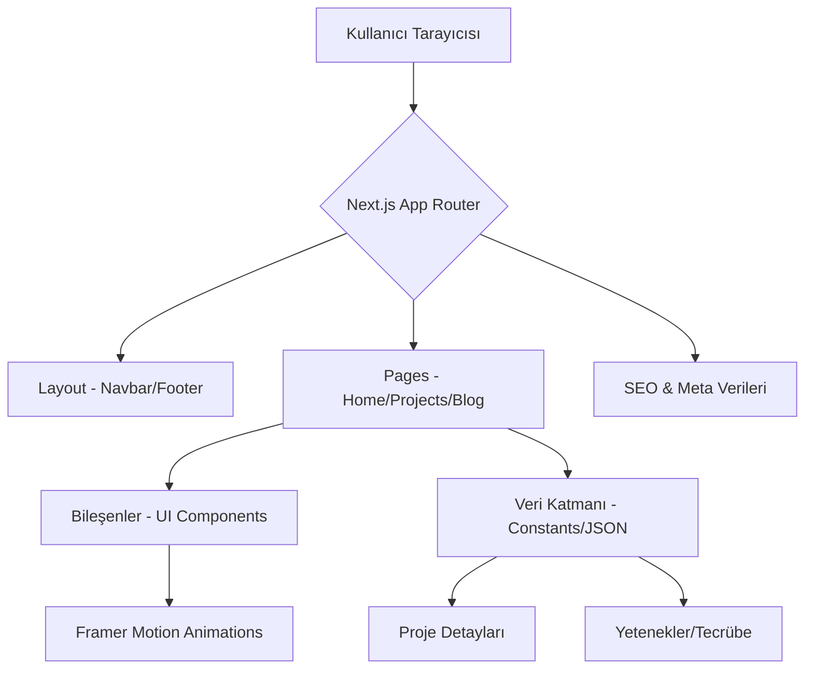

# Devportfolio

[](https://choosealicense.com/licenses/mit/)
[](https://nextjs.org/)
[](https://tailwindcss.com/)
[](http://makeapullrequest.com)

**Devportfolio**, modern yazılım geliştiriciler için tasarlanmış, performans odaklı, SEO dostu ve tamamen özelleştirilebilir bir portfolyo şablonudur. Minimalist tasarımı, akıcı animasyonları ve kullanıcı dostu arayüzü ile teknik yeteneklerinizi ve projelerinizi en profesyonel şekilde sergilemenize olanak tanır.

---

## 📑 İçindekiler

- [✨ Özellikler](#-özellikler)
- [🛠 Teknoloji Yığını](#-teknoloji-yığını)
- [🏗 Mimari Yapı](#-mimari-yapı)
- [⚙️ Kurulum](#-kurulum)
- [🚀 Kullanım](#-kullanım)
- [📸 Ekran Görüntüleri](#-ekran-görüntüleri)
- [🤝 Katkıda Bulunma](#-katkıda-bulunma)
- [📄 Lisans](#-lisans)
- [📧 İletişim](#-iletişim)

---

## ✨ Özellikler

- 📱 **Tam Responsive Tasarım:** Mobil, tablet ve masaüstü cihazlarla %100 uyumlu.
- 🌙 **Dark/Light Mode:** Dahili tema desteği ile kullanıcı tercihine göre otomatik veya manuel geçiş.
- ⚡ **Yüksek Performans:** Next.js Server Components ve optimize edilmiş görseller ile ışık hızında yükleme süreleri.
- 🎨 **Akıcı Animasyonlar:** Framer Motion ile güçlendirilmiş, kullanıcıyı yormayan mikro etkileşimler.
- 🔍 **SEO Optimizasyonu:** Dinamik meta etiketleri, OpenGraph desteği ve semantic HTML yapısı.
- 📊 **Proje Galerisi:** Detaylı filtreleme ve şık kart tasarımları ile projelerinizi sergileyin.
- 📧 **İletişim Formu:** EmailJS veya özel API entegrasyonu için hazır form yapısı.

---

## 🛠 Teknoloji Yığını

| Teknoloji | Açıklama |
| :--- | :--- |
| **Framework** | [Next.js 15](https://nextjs.org/) (App Router) |
| **Styling** | [Tailwind CSS](https://tailwindcss.com/) |
| **Animation** | [Framer Motion](https://www.framer.com/motion/) |
| **Icons** | [Lucide React](https://lucide.dev/) |
| **Type Safety** | [TypeScript](https://www.typescriptlang.org/) |
| **Content** | JSON based data structure |

---

## 🏗 Mimari Yapı

Proje, modern atomik tasarım prensiplerini ve Next.js App Router mimarisini takip eder. Veriler merkezi bir yapıdan (JSON veya CMS) çekilerek bileşenlere dağıtılır.



---

## ⚙️ Kurulum

Projeyi yerel ortamınızda çalıştırmak için aşağıdaki adımları takip edin:

1. **Depoyu klonlayın:**
   ```bash
   git clone https://github.com/Can-Ozan/Devportfolio.git
   cd Devportfolio
   ```

2. **Bağımlılıkları yükleyin:**
   ```bash
   npm install
   # veya
   yarn install
   # veya
   pnpm install
   ```

3. **Çevresel değişkenleri ayarlayın:**
   `.env.example` dosyasını `.env.local` olarak kopyalayın ve gerekli alanları doldurun.

4. **Geliştirme sunucusunu başlatın:**
   ```bash
   npm run dev
   ```
   Tarayıcınızda `http://localhost:3000` adresine gidin.

---

## 🚀 Kullanım

Portfolyoyu kendinize göre özelleştirmek oldukça basittir:

- **Kişisel Bilgiler:** `src/constants/data.ts` (veya benzeri) dosyasını açarak isminizi, biyografinizi ve sosyal medya linklerinizi güncelleyin.
- **Projeler:** `projects` dizisi altındaki verileri kendi projelerinizle değiştirin. Görselleri `public/projects` klasörüne ekleyin.
- **Yetenekler:** Teknik yeteneklerinizi ve sertifikalarınızı ilgili JSON objesi içinden düzenleyin.

---

## 🤝 Katkıda Bulunma

Topluluğun katkıları bu projeyi daha da ileriye taşıyacaktır. Katkıda bulunmak isterseniz:

1. Bu depoyu **Fork** edin.
2. Yeni bir **Feature Branch** oluşturun (`git checkout -b feature/yeniOzellik`).
3. Değişikliklerinizi **Commit** edin (`git commit -m 'Add: Harika bir özellik eklendi'`).
4. Branch'inizi **Push** edin (`git push origin feature/yeniOzellik`).
5. Bir **Pull Request** oluşturun.

---

## 📄 Lisans

Bu proje **MIT Lisansı** altında lisanslanmıştır. Detaylar için [LICENSE](LICENSE) dosyasına göz atabilirsiniz.

---

## 📧 İletişim

Can Ozan - [@GitHub](https://github.com/Can-Ozan)

Proje Bağlantısı: [https://github.com/Can-Ozan/Devportfolio](https://github.com/Can-Ozan/Devportfolio)

---
*Bu README dosyası bir startup vizyonuyla, geliştirici deneyimi ön planda tutularak hazırlanmıştır.*
